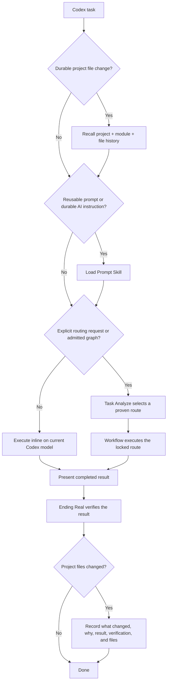
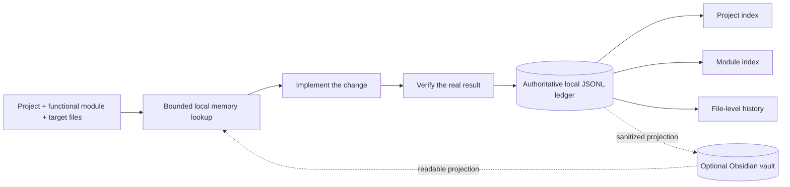
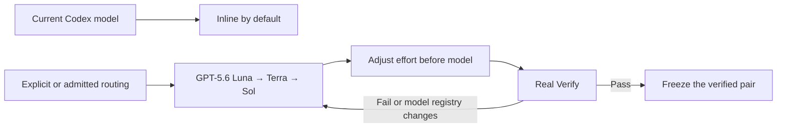
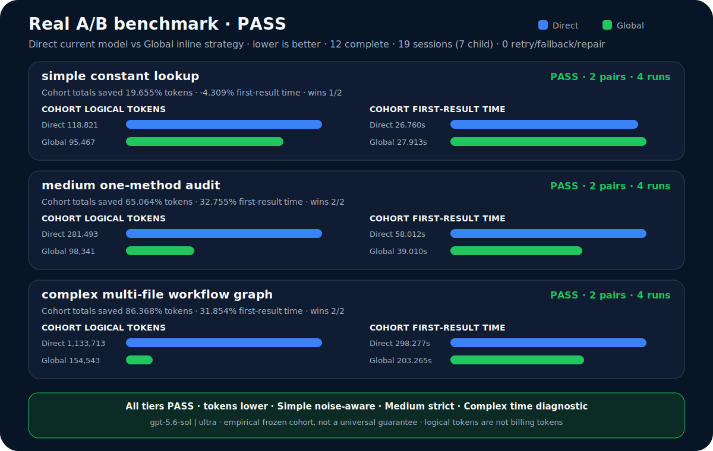

# 🚀 Auto Best Model

### Built for Codex

**⚡ Inline by default · 🧠 remember every durable change · 🧭 route only with proof · ✅ verify after the result**

[中文说明](./README.zh.md)

This is one Codex project mirrored identically to `qin-codex-skills` and `auto-best-model`. The primary adaptive ladder was first tested and used with **GPT-5.6** and is aligned with the latest registered Codex models: `gpt-5.6-luna`, `gpt-5.6-terra`, and `gpt-5.6-sol`.

## 🧠 Basic principles

| | Principle | What it means |
|---|---|---|
| ⚡ | **Direct first** | Ordinary work runs inline on the current Codex model with no routing ceremony. |
| 📣 | **Result first** | Finish and show the requested result before Ending Real verification. |
| 🧭 | **Evidence before routing** | Delegate only when an explicit request or current end-to-end proof justifies it. |
| 🗂️ | **Memory around every change** | Recall project/module/file decisions before editing; record the verified outcome afterward. |
| 🔒 | **Private by design** | Local ledgers, credentials, raw prompts, receipts, and work artifacts never enter the public mirror. |

## 🔄 Core flow

### The short version

- Ordinary work stays inline on the current Codex model.
- Reusable prompts and durable AI instructions always load Prompt Skill.
- Model delegation happens only for an explicit routing request or a route with current end-to-end proof; missing proof stays inline.
- The completed result is shown before Ending Real verification. A failed verification reopens and repairs the task.

## 🗂️ Project change memory

Every durable file change records:

- what changed and every touched project-relative file;
- why that implementation was chosen;
- observable result and verification evidence;
- important decisions, remaining risks, and a superseded record ID when a prior choice is intentionally replaced.

Local memory remains authoritative. Obsidian is optional and never blocks work. Raw prompts, private reasoning, credentials, receipts, and unrelated dirty files are not stored.

## 🤖 Model compatibility

The primary adaptive ladder starts at GPT-5.6 and supports all registered efforts through `ultra`. New Codex models are added through the central routing registry without changing the workflow. `gpt-5.3-codex-spark` remains an optional compatibility route only for explicitly admitted tiny tasks; it is not the primary 5.6+ ladder.

## 📊 Historical benchmark

This frozen **Benchmark v5** used `gpt-5.6-sol | ultra` in both Direct and Global arms: **6 matched A/B pairs, 12 complete runs, 0 retries, 0 fallbacks, and 0 repairs**.

<picture>
  <source media="(max-width: 600px)" srcset="./management-skill/assets/readme/model-benchmark-example-mobile.svg">
  
</picture>

| Tier | Task tokens, Direct → Global | Token saving | First result, Direct → Global | Time saving | Verdict |
|---|---:|---:|---:|---:|---|
| Simple | `118,821 → 95,467` | **19.655%** | `26.760s → 27.913s` | **-4.309%** | 🟡 Noise-bound |
| Medium | `281,493 → 98,341` | **65.064%** | `58.012s → 39.010s` | **32.755%** | 🟢 Improved |
| Complex | `1,133,713 → 154,543` | **86.368%** | `298.277s → 203.265s` | **31.854%** | 🟢 Improved |

> 🏁 Across this selected historical cohort, Global used **77.292% fewer task tokens** and reached first results **29.464% faster**. This is evidence for that frozen cohort—not a universal promise. Task tokens are operational usage, not billing tokens; Ending Real time is excluded.

See the [sanitized benchmark evidence](./task-analyze-skill/assets/model-routing-benchmark-example.json). Raw prompts, paths, session IDs, and receipts remain private.

## 🧩 Eight public Skills

| Skill | Purpose |
|---|---|
| [`Task Analyze`](./task-analyze-skill/SKILL.md) | Explicit model strategy, benchmarks, and route admission. |
| [`Workflow`](./workflow-skill/SKILL.md) | Executes only an admitted locked route. |
| [`Prompt`](./prompt-skill/SKILL.md) | Global gate for reusable prompts and durable AI instructions. |
| [`Code`](./code-skill/SKILL.md) | Python, C#, Unity C#, and registered code domains. |
| [`Project Memory`](./project-memory-skill/SKILL.md) | Project/module/file recall and verified change records. |
| [`Verify`](./verify-skill/SKILL.md) | Post-result Real Verify and regression evidence. |
| [`Optimization`](./optimization-skill/SKILL.md) | Converts stable repeated work into reusable tools and references. |
| [`Management`](./management-skill/SKILL.md) | Privacy-safe profile and two-repository mirror management. |

## 🛠️ Registered execution domains

| Domain | Kind | Owner | Spark obvious-task eligible | Reference |
|---|---|---|---|---|
| `general` (active) | general | `workflow-skill` | no | [`task-analyze-skill/references/model-selection.md`](./task-analyze-skill/references/model-selection.md) |
| `python` (active) | code | `code-skill` | yes | [`code-skill/references/python-rules.md`](./code-skill/references/python-rules.md) |
| `csharp` (active) | code | `code-skill` | yes | [`code-skill/references/csharp-rules.md`](./code-skill/references/csharp-rules.md) |
| `unity_csharp` (active) | code | `code-skill` | yes | [`code-skill/references/unity-csharp-rules.md`](./code-skill/references/unity-csharp-rules.md) |
| `code_unspecified` (history-only) | code | `code-skill` | yes | [`code-skill/references/spark-small-code.md`](./code-skill/references/spark-small-code.md) |

## 📦 Install and privacy

1. Put the eight Skill folders under `~/.codex/skills/`.
2. Merge [`global-agents-entry-rule.md`](./task-analyze-skill/assets/global-agents-entry-rule.md) into `~/.codex/AGENTS.md`.
3. Start Codex normally; no lifecycle hook is installed.

The public mirror excludes auth data, secrets, private ledgers, local routing history, caches, raw prompts/results, receipts, and work artifacts. Publishing runs a public-safety scan before commit and push.
