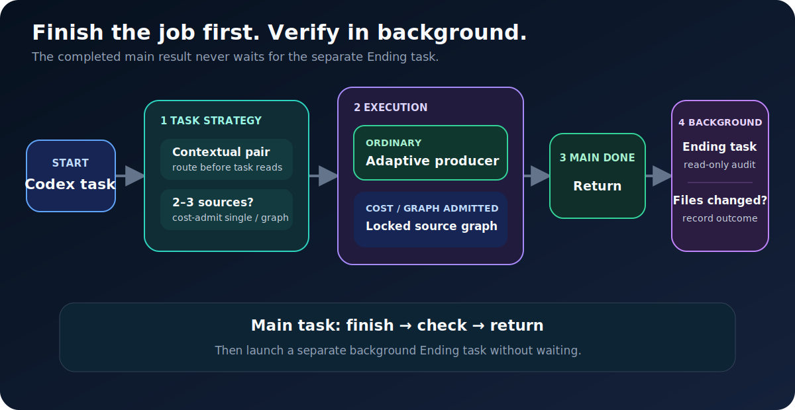

# 🚀 Auto Best Model

**Codex-only · adaptive producer for eligible text/code · inline exceptions · verify after delivery**

[中文说明](./README.zh.md)

Saved highest-family quality ladder · refreshed only when you request a local model update

Current catalog-derived priority producer: `gpt-5.3-codex-spark` · easy=`low` · complex=`high`

## 🔄 Core flow

<picture>
  <source media="(max-width: 600px)" srcset="./management-skill/assets/readme/core-flow-mobile.svg">
  
</picture>

## ⚡ Models & private learning

<picture>
  <source media="(max-width: 600px)" srcset="./management-skill/assets/readme/model-router-mobile.svg">
  
</picture>

- **Priority:** Eligible text/code uses the adaptive catalog priority producer: easy `low`, complex `high`; exact read-only, image/mixed, and tool-only work stays inline.
- **Operational:** With zero result and zero tokens, use the current contextual Obsidian-selected quality pair.
- **Quality:** A published result returns now; Ending automatically logs the receipt-backed failure before a new quality-pair repair with a different verifier.
- **Learning:** Ending outcomes update broad project/Skills `Model Switch.md` pages; project/task/module/file/symbol are fields only—no hierarchy notes.

## Rules

- **Producer:** Eligible text/code uses the adaptive catalog priority producer; exact read-only, image/mixed, and tool-only work stays inline.
- **Prompt:** Reusable prompts and durable AI instructions load Prompt Skill.
- **Route:** Delegate only on explicit request or current end-to-end proof.
- **Deliver:** Show the completed result before Ending Real.
- **Verify:** Ending Real runs after delivery; first-result time excludes it.
- **Files:** Recall project/module/file history before editing; record the verified change after.
- **Memory:** Change history is local JSONL + optional Obsidian; private learning uses broad project/Skills `Model Switch.md`: fields only; no hierarchy notes.
- **Models:** Ordinary tasks use saved JSON; explicit local update selects the highest numeric GPT family, while unavailable cache keeps the saved list.
- **Privacy:** Secrets, raw prompts/results, receipts, ledgers, caches, and work artifacts stay local.

## 📊 Current benchmark

**Benchmark v6** · `gpt-5.6-sol | ultra` in both arms · **6 A/B pairs · 12 runs · 0 retries · 0 fallbacks · 0 repairs**

<picture>
  <source media="(max-width: 600px)" srcset="./management-skill/assets/readme/model-benchmark-example-mobile.svg">
  
</picture>

> **85.284% fewer task tokens** · **8.629% faster** overall first result · all 12 results correct · strategy gate **FAIL**: Medium won 1/2 timing pairs

> Frozen read-only bootstrap cohort; Spark was not eligible here · not billing tokens · Ending Real excluded

[Sanitized benchmark evidence](./task-analyze-skill/assets/model-routing-benchmark-example.json)

## 🧩 Eight public Skills

- [`Task Analyze`](./task-analyze-skill/SKILL.md) — route strategy, benchmarks, and admission.
- [`Workflow`](./workflow-skill/SKILL.md) — admitted locked-route execution.
- [`Prompt`](./prompt-skill/SKILL.md) — reusable prompt and durable AI-instruction gate.
- [`Code`](./code-skill/SKILL.md) — Python, C#, Unity C#, and registered code domains.
- [`Project Memory`](./project-memory-skill/SKILL.md) — project/module/file recall and verified records.
- [`Verify`](./verify-skill/SKILL.md) — post-result Real Verify and regression evidence.
- [`Optimization`](./optimization-skill/SKILL.md) — stable repeated work into reusable tools.
- [`Management`](./management-skill/SKILL.md) — private profiles and public mirror management.

## 🛠️ Registered execution domains

- `general` · general · `workflow-skill` · active · Spark: no · [rules](./task-analyze-skill/references/model-selection.md)
- `python` · code · `code-skill` · active · Spark: yes · [rules](./code-skill/references/python-rules.md)
- `csharp` · code · `code-skill` · active · Spark: yes · [rules](./code-skill/references/csharp-rules.md)
- `unity_csharp` · code · `code-skill` · active · Spark: yes · [rules](./code-skill/references/unity-csharp-rules.md)
- `code_unspecified` · code · `code-skill` · history-only · Spark: yes · [rules](./code-skill/references/spark-small-code.md)

## Install

1. Put the eight Skill folders under `~/.codex/skills/`.
2. Merge [`global-agents-entry-rule.md`](./task-analyze-skill/assets/global-agents-entry-rule.md) into `~/.codex/AGENTS.md`.
3. Start Codex normally; no lifecycle hook is installed.

**Privacy:** The mirror excludes auth, secrets, private ledgers, routing history, caches, raw prompts/results, receipts, and work artifacts; every publish runs a safety scan.

**Mirrors:** `qin-codex-skills` · `auto-best-model`
