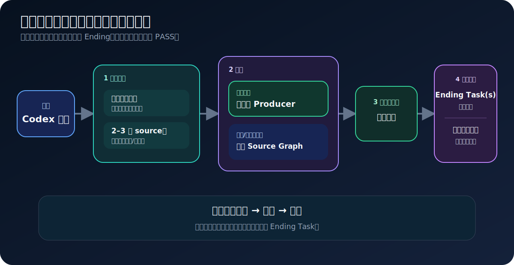
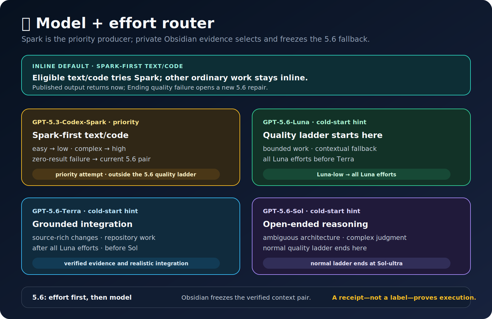
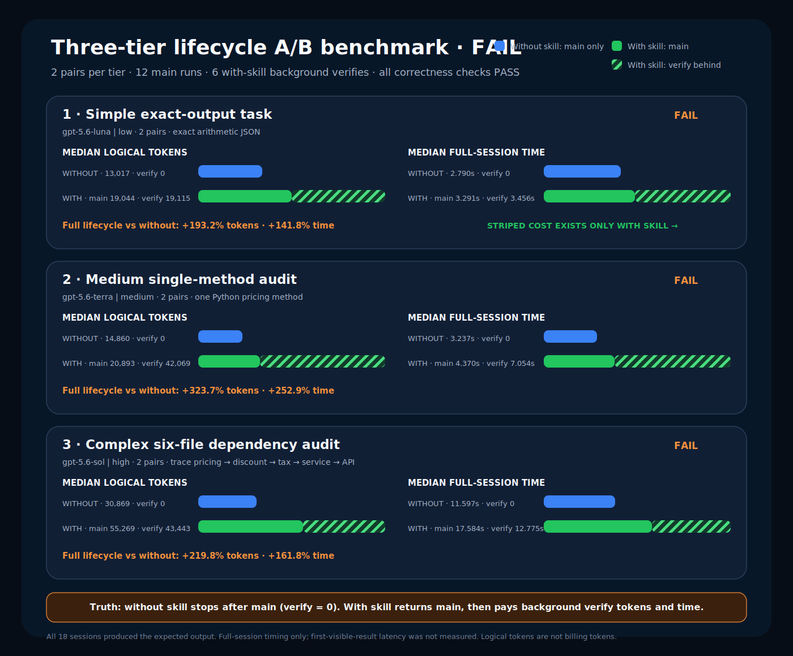

# 🚀 Auto Best Model

**专用于 Codex · 先完成并返回主任务 · 再由独立后台任务验证**

[English](./README.md)

已保存的最高版本家族质量梯级 · 只有你主动要求本地模型更新时才刷新

当前目录推导的优先生产模型：`gpt-5.3-codex-spark` · 简单=`low` · 复杂=`high`

## 🔄 核心流程

<picture>
  <source media="(max-width: 600px)" srcset="./management-skill/assets/readme/core-flow-zh-mobile.svg">
  
</picture>

## ✅ 先完成主任务，再后台验证

这是整个生命周期最重要的结构规则：

1. **主任务先完成用户要求的工作**，只运行与实现相称的本地基础检查。
2. **立即返回已完成结果。** 不让用户被验证、轮询或修复流程卡住。
3. **另开 `End Task-<任务名>` 独立 Codex 后台任务。** 它只读审计已有证据，绝不阻塞已经完成的主任务。
4. **Ending 只返回 PASS 或准确失败。** 不向用户提问、不等待、不轮询、不调用重型 API，也不在 Ending 内修复；失败后另开新的修复任务。

主工作与 Ending 验证刻意使用不同任务会话。“后台”表示主结果一返回，用户就能继续工作；它不表示跳过验证。

## ⚡ 模型与私有学习

<picture>
  <source media="(max-width: 600px)" srcset="./management-skill/assets/readme/model-router-mobile.svg">
  
</picture>

- **优先：** 合格文字/代码使用自适应目录优先生产模型：简单 `low`，复杂 `high`；精确只读、图像/混合和纯工具任务保持 inline。
- **操作故障：** 零结果、零 token 时，使用 Obsidian 当前上下文选择的质量模型档位。
- **质量故障：** 先返回已完成结果；独立后台 Ending 记录 receipt 对应的失败，再由新的修复任务使用不同验证者。
- **学习：** Ending 结果更新宽泛项目/Skills `Model Switch.md` 页面；project/task/module/file/symbol 仅是字段，不创建层级笔记。

## 规则

- **Producer：** 合格文字/代码用自适应目录优先生产模型；精确只读、图像/混合和纯工具任务保持 inline。
- **Prompt：** 可复用 Prompt 和持久 AI 指令加载 Prompt Skill。
- **路由：** 只有明确要求或当前端到端证据成立时才委派。
- **交付：** 先完成并返回主任务结果，再进行后台验证。
- **验证：** 交付后另开不阻塞的 `End Task-<任务名>`；first-result 不包含它。
- **文件：** 修改前回溯项目/模块/文件历史；修改后记录已验证结果。
- **记忆：** 修改历史用本地 JSONL（可投影 Obsidian）；私有学习用宽泛项目/Skills `Model Switch.md`，仅字段，不建层级笔记。
- **模型：** 普通任务只读已保存 JSON；主动本地更新时选择最高数字 GPT 家族，缓存不可用就保留原列表。
- **隐私：** secret、原始 Prompt/结果、receipt、ledger、cache 和临时文件留在本地。

## 📊 完整生命周期 Benchmark：主任务 + Ending Task

**技术结论：** 当前全局 Skill 在这个微型精确输出任务上保持了正确性，但没有提升性能。六组配对运行中，启用 Skill 的完整生命周期有五组更慢，中位完整时间增加 **17.6%**，中位 token 增加 **46.1%**。

### 主工作与后台验证成本

| 模式 | 主任务 token | 接在主任务后面的验证 token | Cohort 总 token | 主任务时间 | 接在主任务后面的验证时间 | Cohort 总时间 |
|---|---:|---:|---:|---:|---:|---:|
| 不启用全局 Skill | 78,102 | 78,585 (50.2%) | 156,687 | 19.153 s | 18.039 s (48.5%) | 37.192 s |
| 启用全局 Skill | 114,826 | 114,727 (50.0%) | 229,553 | 22.138 s | 24.628 s (52.7%) | 46.766 s |

图中用条纹段把验证成本明确地放在**主任务成本后面**。Ending 不阻塞主结果交付，但它的时间和 token 仍是真实生命周期成本。本次 benchmark 没有采集首次可见结果延迟，因此不会把完整主 session 时间冒充 first-result 时间。

### 全貌

| 模式 | 主任务中位时间 | Ending 中位时间 | 完整生命周期中位时间 | 总 token 中位数 | 完整生命周期胜出 |
|---|---:|---:|---:|---:|---:|
| 不启用全局 Skill | 2.773 s | 2.778 s | 6.091 s | 26,113 | 基线 |
| 启用全局 Skill | 3.322 s | 3.473 s | 7.164 s | 38,163 | 1/6 |
| Skill 开销 | +19.8% | +25.0% | +17.6% | +46.1% | 5/6 更慢 |

“完整生命周期”先在每次运行中计算主任务 + Ending，再取六次总时间的中位数；它不等于两个阶段中位数直接相加。

### 六组完整配对结果

| 运行 | 无 Skill：主任务 | 无 Skill：Ending | 无 Skill：总计 | 有 Skill：主任务 | 有 Skill：Ending | 有 Skill：总计 | 总计更快 |
|---:|---:|---:|---:|---:|---:|---:|---|
| 1 | 5.135 s | 2.918 s | 8.053 s | 3.226 s | 3.236 s | 6.462 s | 有 Skill |
| 2 | 2.256 s | 2.635 s | 4.891 s | 5.478 s | 3.628 s | 9.106 s | 无 Skill |
| 3 | 2.629 s | 4.201 s | 6.830 s | 3.561 s | 4.111 s | 7.672 s | 无 Skill |
| 4 | 2.508 s | 2.729 s | 5.237 s | 3.230 s | 3.318 s | 6.548 s | 无 Skill |
| 5 | 2.916 s | 2.801 s | 5.717 s | 3.242 s | 7.081 s | 10.323 s | 无 Skill |
| 6 | 3.709 s | 2.755 s | 6.464 s | 3.401 s | 3.254 s | 6.655 s | 无 Skill |

### Token 证据

| 运行 | 无 Skill：主任务 | 无 Skill：Ending | 无 Skill：总计 | 有 Skill：主任务 | 有 Skill：Ending | 有 Skill：总计 |
|---:|---:|---:|---:|---:|---:|---:|
| 1 | 13,017 | 13,101 | 26,118 | 19,044 | 19,119 | 38,163 |
| 2 | 13,017 | 13,092 | 26,109 | 19,044 | 19,119 | 38,163 |
| 3 | 13,017 | 13,092 | 26,109 | 19,606 | 19,131 | 38,737 |
| 4 | 13,017 | 13,093 | 26,110 | 19,044 | 19,119 | 38,163 |
| 5 | 13,017 | 13,109 | 26,126 | 19,044 | 19,120 | 38,164 |
| 6 | 13,017 | 13,098 | 26,115 | 19,044 | 19,119 | 38,163 |
| **中位数** | **13,017** | **13,096** | **26,113** | **19,044** | **19,119** | **38,163** |

### 方法与证据

- **样本：** 6 组配对、24 个独立 session（两种模式都包含 `主任务 + Ending`），使用相同的 `gpt-5.6-luna | low` 和相同精确工作负载。
- **顺序控制：** 第 1、3、5 组先运行无 Skill；第 2、4、6 组先运行有 Skill。
- **无 Skill：** 关闭用户配置/全局 Skill，但测试工具仍另开一个干净审计 session，让两种模式保持相同的双 session 结构。
- **有 Skill：** 加载当前全局配置；Ending 以独立 `ENDING_TASK_WORKER` session 运行。
- **正确性：** 主任务 12/12 PASS，Ending 12/12 PASS，0 reroute。
- **一致性：** 主任务 workload SHA-256 `6ed46ac3699918ac054b2bf8e9d9da2be31628443a4d142848a121432f905c2b`；Ending workload SHA-256 `9ffe75646e4ecb36f6426026ad6005dd8947d2635c435dde36bb4fe5b89fee6a`；主输出 SHA-256 始终为 `7ba6fb88894e1d0faf389562cd4639eae0d733bcae056d8788d606a8777a5121`。
- **计时定义：** 完整 session/process 时间，不是首次可见结果时间。所有运行使用只读 sandbox。

### 决策与限制

这个 Skill 在该微型工作负载上**不满足性能准入**：结果同样正确，但耗时与 token 更高。这是生命周期开销的描述性证据，不代表复杂代码任务的质量结果。公开报告已去除原始 Prompt、私有路径、receipt 和 session ID。

## 🧩 八个公开 Skill

- [`Task Analyze`](./task-analyze-skill/SKILL.md) — 路由策略、benchmark 和准入。
- [`Workflow`](./workflow-skill/SKILL.md) — 执行已准入的锁定路线。
- [`Prompt`](./prompt-skill/SKILL.md) — 可复用 Prompt 和持久 AI 指令入口。
- [`Code`](./code-skill/SKILL.md) — Python、C#、Unity C# 和已注册代码域。
- [`Project Memory`](./project-memory-skill/SKILL.md) — 项目/模块/文件回溯和验证记录。
- [`Verify`](./verify-skill/SKILL.md) — 结果之后的 Real Verify 和回归证据。
- [`Optimization`](./optimization-skill/SKILL.md) — 把稳定重复流程变成工具。
- [`Management`](./management-skill/SKILL.md) — 私有 profile 和公共镜像管理。

## 🛠️ 已注册执行域

- `general` · general · `workflow-skill` · active · Spark: no · [rules](./task-analyze-skill/references/model-selection.md)
- `python` · code · `code-skill` · active · Spark: yes · [rules](./code-skill/references/python-rules.md)
- `csharp` · code · `code-skill` · active · Spark: yes · [rules](./code-skill/references/csharp-rules.md)
- `unity_csharp` · code · `code-skill` · active · Spark: yes · [rules](./code-skill/references/unity-csharp-rules.md)
- `code_unspecified` · code · `code-skill` · history-only · Spark: yes · [rules](./code-skill/references/spark-small-code.md)

## 安装

1. 把八个 Skill 文件夹放进 `~/.codex/skills/`。
2. 将 [`global-agents-entry-rule.md`](./task-analyze-skill/assets/global-agents-entry-rule.md) 合并到 `~/.codex/AGENTS.md`。
3. 正常启动 Codex；不安装生命周期 hook。

**隐私：** 镜像排除 auth、secret、私有 ledger、路由历史、cache、原始 Prompt/结果、receipt 和临时文件；每次发布都运行安全检查。

**镜像：** `qin-codex-skills` · `auto-best-model`
