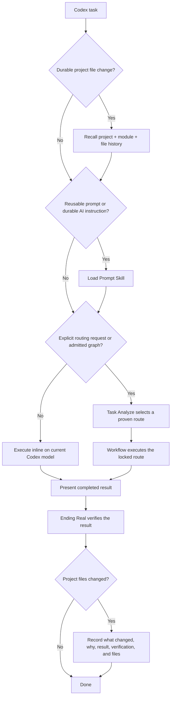
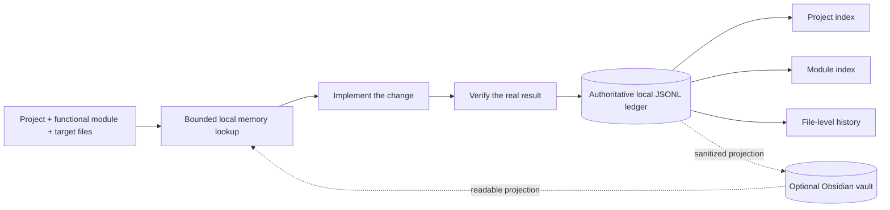
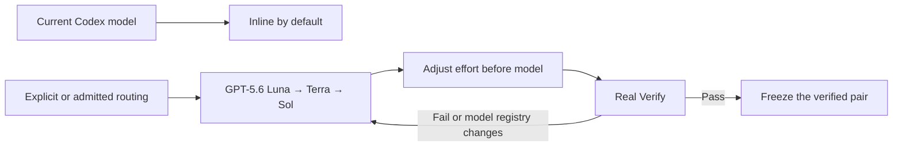

# AutoBestModel for Codex

**A compact global Skill system for direct execution, verified model routing, and durable project-change memory.**

[中文说明](./README.zh.md)

This is one Codex project mirrored identically to `qin-codex-skills` and `AutoBestModel`. The primary adaptive ladder was first tested and used with **GPT-5.6** and is aligned with the latest registered Codex models: `gpt-5.6-luna`, `gpt-5.6-terra`, and `gpt-5.6-sol`.

## Core flow

Core rules:

- Ordinary work stays inline on the current Codex model.
- Reusable prompts and durable AI instructions always load Prompt Skill.
- Model delegation happens only for an explicit routing request or a route with current end-to-end proof; missing proof stays inline.
- The completed result is shown before Ending Real verification. A failed verification reopens and repairs the task.

## Project change memory

Every durable file change records:

- what changed and every touched project-relative file;
- why that implementation was chosen;
- observable result and verification evidence;
- important decisions, remaining risks, and a superseded record ID when a prior choice is intentionally replaced.

Local memory remains authoritative. Obsidian is optional and never blocks work. Raw prompts, private reasoning, credentials, receipts, and unrelated dirty files are not stored.

## Model compatibility

The primary adaptive ladder starts at GPT-5.6 and supports all registered efforts through `ultra`. New Codex models are added through the central routing registry without changing the workflow. `gpt-5.3-codex-spark` remains an optional compatibility route only for explicitly admitted tiny tasks; it is not the primary 5.6+ ladder.

## Eight public Skills

| Skill | Purpose |
|---|---|
| [`Task Analyze`](./task-analyze-skill/SKILL.md) | Explicit model strategy, benchmarks, and route admission. |
| [`Workflow`](./workflow-skill/SKILL.md) | Executes only an admitted locked route. |
| [`Prompt`](./prompt-skill/SKILL.md) | Global gate for reusable prompts and durable AI instructions. |
| [`Code`](./code-skill/SKILL.md) | Python, C#, Unity C#, and registered code domains. |
| [`Project Memory`](./project-memory-skill/SKILL.md) | Project/module/file recall and verified change records. |
| [`Verify`](./verify-skill/SKILL.md) | Post-result Real Verify and regression evidence. |
| [`Optimization`](./optimization-skill/SKILL.md) | Converts stable repeated work into reusable tools and references. |
| [`Management`](./management-skill/SKILL.md) | Privacy-safe profile and two-repository mirror management. |

## Registered execution domains

<!-- EXECUTION_DOMAIN_TABLE -->

## Install and privacy

1. Put the eight Skill folders under `~/.codex/skills/`.
2. Merge [`global-agents-entry-rule.md`](./task-analyze-skill/assets/global-agents-entry-rule.md) into `~/.codex/AGENTS.md`.
3. Start Codex normally; no lifecycle hook is installed.

The public mirror excludes auth data, secrets, private ledgers, local routing history, caches, raw prompts/results, receipts, and work artifacts. Publishing runs a public-safety scan before commit and push.
