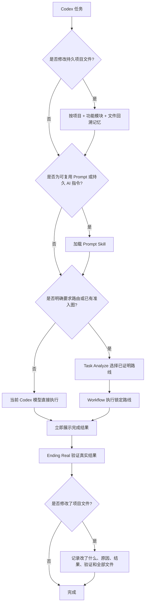
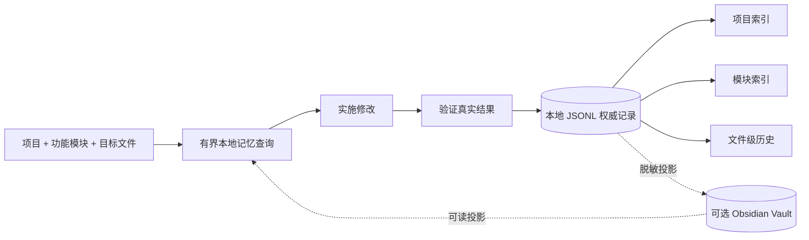
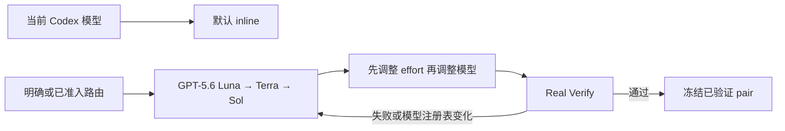

# 🚀 Auto Best Model

### 专门给 Codex 使用

**⚡ 默认直接执行 · 🧠 记住每次持久修改 · 🧭 有证据才路由 · ✅ 结果展示后再验证**

[English](./README.md)

这是同一个 Codex 项目，同时完整镜像到 `qin-codex-skills` 和 `auto-best-model` 两个仓库。主要自适应模型阶梯从 **GPT-5.6** 开始测试和使用，当前适配的最新注册模型为 `gpt-5.6-luna`、`gpt-5.6-terra`、`gpt-5.6-sol`。

## 🧠 基本原理

| | 原理 | 含义 |
|---|---|---|
| ⚡ | **直接优先** | 普通工作使用当前 Codex 模型 inline 执行，不增加路由仪式。 |
| 📣 | **结果优先** | 先完成并展示用户要的结果，再运行 Ending Real。 |
| 🧭 | **路由需要证据** | 只有明确要求或当前端到端证据成立时才委派。 |
| 🗂️ | **修改前后都有记忆** | 修改前回溯项目/模块/文件决定，修改后记录验证结果。 |
| 🔒 | **默认保护隐私** | 私有 ledger、账号信息、原始 Prompt、receipt 和临时文件不进入公共镜像。 |

## 🔄 核心流程

### 一句话规则

- 普通任务保留当前 Codex 模型 inline 执行。
- 可复用 Prompt 和持久 AI 指令必须加载 Prompt Skill。
- 只有明确路由请求或具有当前端到端证明的路线才允许委派；证据不足就保持 inline。
- 完成结果先展示，Ending Real 随后验证；失败会重新打开并修复。

## 🗂️ 项目修改记忆

每次持久文件修改都会记录：

- 修改内容和本任务涉及的全部项目相对路径；
- 为什么选择这个实现；
- 可观察结果和验证证据；
- 关键决定、剩余风险，以及推翻旧决定时的 superseded 记录 ID。

本地记忆始终是权威来源；Obsidian 只做可读投影，未连接也不阻塞。不会保存原始 Prompt、私有推理、账号凭证、receipt 或无关 dirty 文件。

## 🤖 模型适配

主要自适应阶梯从 GPT-5.6 开始，并支持到 `ultra` 的已注册 effort。最新 Codex 模型通过中央路由注册表加入，不需要重写工作流。`gpt-5.3-codex-spark` 仅保留为明确准入 tiny 任务的兼容路线，不属于主要 5.6+ 阶梯。

## 📊 历史 Benchmark

这组冻结的 **Benchmark v5** 在 Direct 与 Global 两边都使用 `gpt-5.6-sol | ultra`：**6 组配对 A/B、12 次完整运行、0 retry、0 fallback、0 repair**。

<picture>
  <source media="(max-width: 600px)" srcset="./management-skill/assets/readme/model-benchmark-example-mobile.svg">
  
</picture>

| 级别 | Task tokens，Direct → Global | Token 节省 | 首次结果，Direct → Global | 时间节省 | 结论 |
|---|---:|---:|---:|---:|---|
| Simple | `118,821 → 95,467` | **19.655%** | `26.760s → 27.913s` | **-4.309%** | 🟡 噪声范围 |
| Medium | `281,493 → 98,341` | **65.064%** | `58.012s → 39.010s` | **32.755%** | 🟢 改善 |
| Complex | `1,133,713 → 154,543` | **86.368%** | `298.277s → 203.265s` | **31.854%** | 🟢 改善 |

> 🏁 在这组历史样本中，Global 共减少 **77.292% task tokens**，首次结果快 **29.464%**。这只是冻结样本的证据，不是所有任务的保证。Task tokens 不是计费 tokens；Ending Real 时间不计入首次结果。

查看[脱敏 benchmark 证据](./task-analyze-skill/assets/model-routing-benchmark-example.json)。原始 Prompt、路径、session ID 和 receipt 保持私有。

## 🧩 八个公开 Skill

| Skill | 作用 |
|---|---|
| [`Task Analyze`](./task-analyze-skill/SKILL.md) | 明确模型策略、benchmark 和路线准入。 |
| [`Workflow`](./workflow-skill/SKILL.md) | 只执行已经准入的锁定路线。 |
| [`Prompt`](./prompt-skill/SKILL.md) | 可复用 Prompt 和持久 AI 指令的全局入口。 |
| [`Code`](./code-skill/SKILL.md) | Python、C#、Unity C# 和已注册代码域。 |
| [`Project Memory`](./project-memory-skill/SKILL.md) | 项目/模块/文件回溯和已验证修改记录。 |
| [`Verify`](./verify-skill/SKILL.md) | 结果展示后的 Real Verify 和回归证据。 |
| [`Optimization`](./optimization-skill/SKILL.md) | 把稳定重复流程变成可复用工具和引用。 |
| [`Management`](./management-skill/SKILL.md) | 隐私安全的 profile 与双仓库镜像管理。 |

## 🛠️ 已注册执行域

<!-- EXECUTION_DOMAIN_TABLE -->

## 📦 安装与隐私

1. 把八个 Skill 文件夹放进 `~/.codex/skills/`。
2. 将 [`global-agents-entry-rule.md`](./task-analyze-skill/assets/global-agents-entry-rule.md) 合并到 `~/.codex/AGENTS.md`。
3. 正常启动 Codex；不安装生命周期 hook。

公共镜像排除 auth、secret、私有 ledger、本地路由历史、cache、原始 Prompt/结果、receipt 和临时工作文件。每次发布前都会运行公开安全检查。
