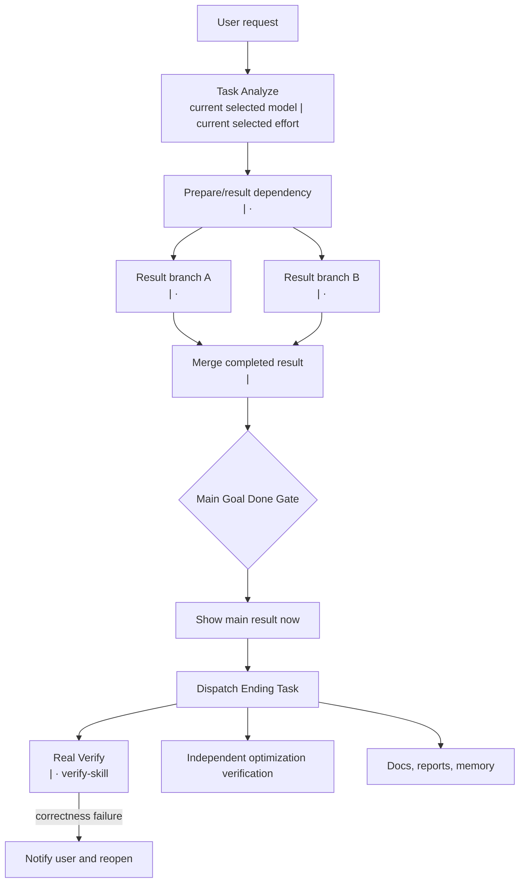

# Admitted Workflow Display Templates

Ordinary requests stay inline on the current model and show no route. Use these only after explicit Task Analyze activation and positive end-to-end performance admission.

## Admitted Single Node: Text Only

```text
Route: Task Analyze [current selected model | current selected effort] -> <direct action> [<model> | <effort>, <skill>] -> Show main result now -> Dispatch Ending Task -> Real Verify [<model> | <effort>, verify-skill]
```

Do not add Mermaid or a formal target map for one admitted node. There is no foreground Mini/Fast Verify.

## Admitted Complex Graph: Mermaid



## Workflow With Models

After the Mermaid diagram, list each real node with purpose, exact model ID, effort, installed owning skill, dependencies, output, and stop condition. Do not expose machine plan JSON.

## Ordering Invariants

- Foreground contains result work only.
- Main Result depends on completed result work, not a verification verdict.
- Main Result always precedes Ending Task.
- Ending Task always follows Main Result.
- Real Verify never contributes to user-visible first-result latency.
- A Real correctness failure notifies, reopens, repairs, and presents a corrected result.
